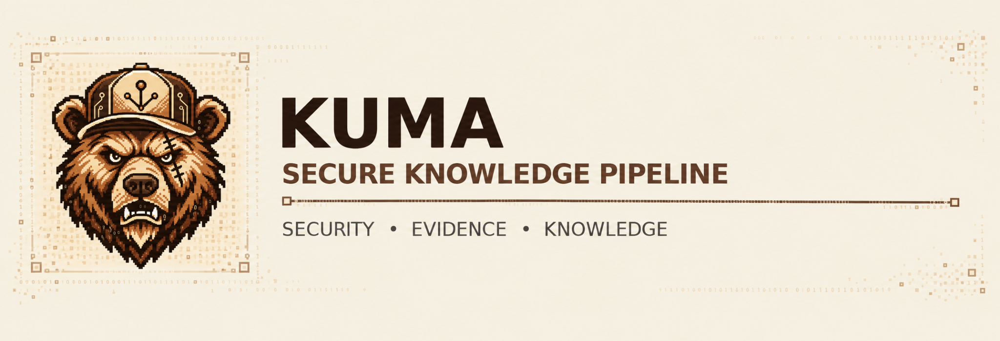
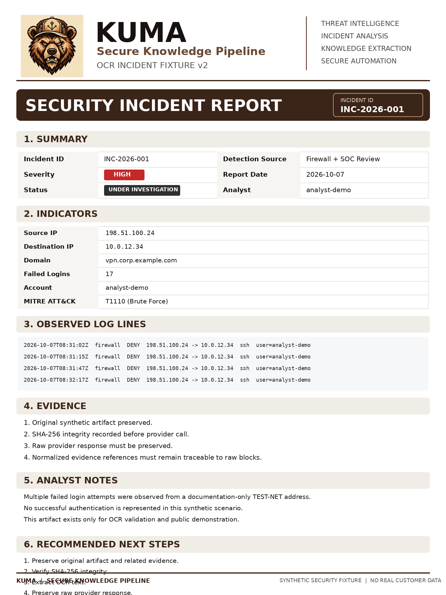

# KUMA Secure Knowledge Pipeline



[](https://github.com/KUMA-LAB-1/kuma-secure-knowledge-pipeline/actions/workflows/security-ci.yml)

**Pipeline de segurança orientado por evidências: OCR verificável, orquestração e enriquecimento com IA generativa.**

O KUMA Secure Knowledge Pipeline é um projeto independente de engenharia de software e segurança. O **Challenge 01** estabeleceu a extração OCR, a integridade e a rastreabilidade documental; o **Challenge 02** acrescentou contratos GenAI e orquestração funcional **offline**, em revisão no [PR #3](https://github.com/KUMA-LAB-1/kuma-secure-knowledge-pipeline/pull/3); o **Challenge 03** está planejado para recuperação de conhecimento e citações.

> **Estado técnico em 10/10/2026:** Challenge 01 integrado e versionado em [`v0.1.0-ocr-evidence`](https://github.com/KUMA-LAB-1/kuma-secure-knowledge-pipeline/tree/v0.1.0-ocr-evidence). Challenge 02: implementação local demonstrada, 244 testes globais locais aprovados e [Security CI GREEN](https://github.com/KUMA-LAB-1/kuma-secure-knowledge-pipeline/actions/runs/38041583472) no commit `57fdd91`; PR #3 ainda **Draft e sem merge**. Não houve execução real de AWS Step Functions, Bedrock, Lambda ou S3 nesse incremento.

> **Transparência:** o fluxo OCR local com **Tesseract** foi executado e auditado. O adapter **Amazon Textract** foi desenvolvido e testado com respostas sintéticas, porém a primeira tentativa real de `DetectDocumentText` foi bloqueada com `SubscriptionRequiredException`. **Não existe resultado OCR AWS bem-sucedido neste Challenge 01.** Os motores não são apresentados como equivalentes, nem suas evidências são misturadas.

## 1. Arquitetura do Challenge 01

```text
Imagem sintética (PNG/JPEG)
          |
          v
SourceArtifact (identificação, tipo e SHA-256)
          |
          v
ExtractionProvenance + reserva fail-closed
          |
          v
Verificação de integridade e assinatura da entrada
          |
          v
     Adapter OCR
      /       \
     /         \
Textract       Tesseract local
(boto3,        (subprocess sem shell,
 simulado)      timeout, TSV real)
     \         /
      \       /
          v
Resposta bruta do provedor
          |
          v
Normalização -> ExtractionResult / EvidenceReference
          |
          v
Bundle de sucesso (publicação sem overwrite)
  |- raw-response.json
  |- normalized.json
  |- extracted.txt
  `- manifest.json
          |
          v
Liberação da reserva após publicação durável
```

A camada compartilhada preserva `SourceArtifact`, `ExtractionProvenance`, `ExtractionResult` e `EvidenceReference`. A reserva é adquirida antes da interação com o motor de OCR. Em caso de sucesso, ela é liberada somente após a publicação das evidências; falhas ambíguas mantêm a reserva. Falhas de normalização podem gerar um bundle classificado com os dados brutos e o manifesto. Os adapters têm diferenças explícitas: o Textract oferece blocos `LINE` e identificadores próprios; o Tesseract local utiliza linhas TSV e referências do tipo `tsv-row-N`.

**Fluxos implementados:**

- **Amazon Textract:** assinatura e integridade da entrada, cliente com região explícita `us-east-1`, `total_max_attempts=1`, normalização estrita de blocos, tratamento de falhas, persistência e testes com cliente sintético.
- **Tesseract local:** execução offline com binário e diretório de idiomas fornecidos explicitamente, seleção `por` e PSM 6, timeout, checagem de integridade, TSV bruto com SHA-256, normalização, provenance e publicação de evidências.
- **Evidência:** vínculo ao SHA-256 da imagem, execução identificada por `run_id`, referência aos elementos retornados pelo provedor, recusa de sobrescrita e reserva de execução em casos ambíguos.

A extração local não é um sandbox para documentos potencialmente hostis: o limite de tamanho de saída é validado após o subprocesso encerrar, e a inspeção de assinatura/hash não constitui decodificação segura do conteúdo da imagem.

## 2. Entrada de demonstração

A fixture de referência do Challenge 01 é **sintética** e utiliza identificadores de exemplo, sem dados de clientes ou incidentes reais.



Arquivo: `tests/fixtures/ocr/textract/v2/KUMA_TEXTRACT_FIXTURE_INCIDENT_v2.png`

SHA-256 congelado:

```text
0e1d092c3de25bc2fb9affc8d291f61ee716dfbe19ecce84da4717ff4c4d5fa8
```

A fixture v2 é o baseline reprodutível. Outras variações experimentais, quando documentadas, não substituem essa entrada de referência.

## 3. Como executar o OCR local

**Requisitos:** Python 3.12+, [uv](https://docs.astral.sh/uv/), Tesseract OCR 5.x instalado no computador e arquivo de idioma `por.traineddata`. A instalação do motor e dos modelos é separada das dependências Python. O exemplo a seguir demonstra o uso da interface do adapter em Windows/PowerShell; a execução real do OCR local e a auditoria das evidências foram validadas separadamente.

Instale as dependências do projeto:

```powershell
uv sync --locked --group dev
```

Configure os caminhos do seu ambiente (substitua quando necessário):

```powershell
$env:KUMA_TESSERACT_BIN = 'C:\Program Files\Tesseract-OCR\tesseract.exe'
$env:KUMA_TESSDATA_DIR = Join-Path $env:USERPROFILE 'KUMA_OCR_MODELS\tessdata'
$env:KUMA_EVIDENCE_DIR = Join-Path $env:USERPROFILE 'KUMA_OCR_EVIDENCE\challenge-01'
```

Na raiz do repositório, execute o adaptador sem AWS:

```powershell
@'
import os
from pathlib import Path
from kuma_secure_knowledge_pipeline.extraction.tesseract_local import (
    run_local_tesseract_pipeline,
)

bundle = run_local_tesseract_pipeline(
    source_path=Path(
        'tests/fixtures/ocr/textract/v2/KUMA_TEXTRACT_FIXTURE_INCIDENT_v2.png'
    ),
    output_root=Path(os.environ['KUMA_EVIDENCE_DIR']),
    binary_path=Path(os.environ['KUMA_TESSERACT_BIN']),
    tessdata_dir=Path(os.environ['KUMA_TESSDATA_DIR']),
    language='por',
    psm=6,
    timeout_seconds=45,
)
print('Bundle:', bundle)
'@ | uv run --locked python -
```

A execução gera um `run_id` novo. **Não reutilize um `run_id` após uma falha ambígua**, nem remova reservas para forçar uma nova tentativa. O diretório sugerido fica fora do Git, e o comando acima não acessa serviços AWS.

## 4. Resultado observado e auditoria de evidências

Uma execução local da fixture v2 em **08/10/2026** criou os quatro artefatos previstos. Uma auditoria posterior, sem reexecutar OCR, confirmou inventário, vínculo do `run_id`, origem, raw TSV e equivalência do texto normalizado depois de serialização compatível com JSON.

| Indicador | Resultado observado |
|---|---|
| Motor real | Tesseract local 5.4.x, idioma `por`, PSM 6 |
| Palavras com referências TSV | 197 |
| Média das confianças retornadas | 88,75/100 |
| Evidências | 4 de 4 arquivos verificados |
| Integridade da fonte | SHA-256 v2 conferido |
| SHA-256 da resposta TSV bruta | `909c639be45811d914b8fb6002adfbb2e6af27bb059f7a491e9d4b1ea3eb7369` |
| Execução AWS nesta validação | Nenhuma |

**Exemplos do texto efetivamente extraído:**

```text
Incident ID INC-2026-001 Detection Source Firewall + SOC Review
Failed Logins 17
MITRE ATT&CK 71110 (Brute Force)
```

O identificador MITRE esperado era `T1110`, mas o OCR local leu `71110`. Essa divergência **não foi corrigida no dado extraído**. Ela mostra por que confidence OCR não equivale a veracidade semântica: para campos críticos, o dado reconhecido precisa ser conferido contra a imagem e seu baseline humano.

O arquivo `raw-response.json` do adapter local contém `tsv_text` e `tsv_sha256`; `normalized.json` contém o contrato normalizado; `extracted.txt` contém o texto de leitura; `manifest.json` vincula fonte, execução e propriedades de extração. Os arquivos produzidos pela execução real permanecem **fora do repositório público**, sujeitos a revisão antes de qualquer publicação de trechos ou imagens.

## 5. Situação do Amazon Textract

O código Textract mantém suporte a `DetectDocumentText`, cliente boto3 configurado explicitamente para `us-east-1` e tentativas automáticas do SDK desabilitadas. A fundação foi exercitada com testes locais, respostas sintéticas e verificações de segurança.

Na única tentativa real autorizada, a API retornou `SubscriptionRequiredException` antes de produzir OCR utilizável. Por restrição de disponibilidade/assinatura no ambiente AWS utilizado e pela política do projeto de **não realizar novas operações potencialmente faturáveis**, a execução AWS permanece bloqueada. Nenhum resultado do Tesseract foi rotulado como resposta do Textract, e o experimento adicional com `AnalyzeDocument` não foi realizado.

Assim, a entrega demonstra **integração implementada e testada por simulação com o Textract**, mais **extração efetiva demonstrada com Tesseract offline**. Essa execução local não substitui a validação do serviço Amazon Textract em ambiente AWS.

Consulte [a configuração AWS sanitizada](docs/aws/CONFIGURACAO_INICIAL.md). Ela é documentação de laboratório, não instrução para realizar chamadas AWS durante este projeto sem uma autorização específica.

## 6. Testes e segurança

Na validação local em **08/10/2026**, após os incrementos do Tesseract, o projeto registrou:

```text
pytest direcionado (adapter Tesseract): 4 passed
pytest global:                       80 passed
ruff check (arquivos do adapter):    passed
ruff format --check:                passed
```

O pipeline de CI também inclui pytest, Ruff, Bandit, pip-audit, detect-secrets, higiene de diff e smoke test. **Os 80 testes acima registram um checkpoint histórico do Challenge 01, não o total de testes do projeto atual.** O marco OCR foi posteriormente integrado e preservado na tag [`v0.1.0-ocr-evidence`](https://github.com/KUMA-LAB-1/kuma-secure-knowledge-pipeline/tree/v0.1.0-ocr-evidence); a validação mais recente da branch Challenge 02 está documentada na seção 10.

Verificações importantes: dados sintéticos, validação de integridade da fonte, checagem de tipo e assinatura, rejeição de resposta malformada, referências rastreáveis, execução sem shell no Tesseract, timeout, rejeição de overwrite e comportamento fail-closed para reservas de execução. Todos os limites e resultados devem ser interpretados dentro do ambiente testado, não como garantia geral de isolamento contra entradas hostis.

Regras de publicação: [Política de Dados Públicos](docs/security/PUBLIC_DATA_POLICY.md). Logs, credenciais, IDs de conta, ARNs, caminhos pessoais e evidências de clientes não devem ser publicados.

## 7. Estrutura relevante

```text
src/kuma_secure_knowledge_pipeline/
  artifacts.py                   # Identidade e SHA-256 da origem
  contracts.py                   # Contratos de extração e referência
  evidence.py                    # Persistência de evidência e reservation
  provenance.py                  # Metadados da execução
  runner.py                      # Pipeline via interface de cliente Textract
  extraction/
    client.py                    # Fronteira/adapter AWS Textract
    textract.py                  # Normalizador Textract
    tesseract.py                 # Normalizador de TSV
    tesseract_local.py           # Execução OCR offline + evidence bundle

tests/
  fixtures/ocr/textract/v2/      # Fixture sintética congelada
  test_tesseract_tsv.py          # Contrato e validação TSV
  test_tesseract_local.py        # Adapter local e falhas
  smoke/                         # Teste funcional de fronteira

.github/workflows/security-ci.yml
scripts/quality-gate.ps1
```

## 8. Lições aprendidas

1. **A resposta bruta vem antes da interpretação.** O OCR pode reconhecer um identificador de segurança incorretamente, mesmo devolvendo confiança elevada em parte das palavras.
2. **O mesmo contrato não implica o mesmo serviço.** Textract e Tesseract têm formatos e capacidades diferentes; adapters desacoplam a aplicação sem falsificar equivalência.
3. **Falha controlada também é evidência.** A tentativa AWS bloqueada foi registrada sem retries automáticos, sem alteração oportunista de permissões ou de plano de cobrança.
4. **Teste sintético e demonstração real respondem perguntas diferentes.** Os testes protegem contratos e casos de falha; o OCR real comprova o caminho executável no ambiente local.

## 9. Challenge 02: orquestração de evidências e GenAI (offline)

A evolução mantém o núcleo de segurança e o vínculo com a evidência original. Não se trata de um assistente de delivery: é uma implementação autoral orientada à análise de evidências SOC.

```text
Bundle OCR existente (raw / normalized / texto / manifest)
       |
       v
LoadEvidence -> AnalysisInput verificado
       |
       v
BuildRequest -> GenAIRequest com referências autorizadas
       |
       v
Enrich -> GenAIProvider -> StructuredEnrichment
       |                         (fatos + refs, hipóteses,
       |                          lacunas, verificações)
       v
PersistResult -> LocalStageStore -> result:<sha256>
       |
       v
Resultado local auditável e commit idempotente
```

**Implementado e exercitado localmente:**

- `genai_request.py`, `genai_response.py`, `genai_json.py` e `genai_provider.py`: contratos e validação de entrada/saída, limites e referências vinculadas às evidências.
- `genai_ollama.py`: adapter para **Ollama** em loopback, com demonstração separada de inferência real utilizando Qwen local. O `FakeGenAIProvider` sustenta testes reproduzíveis sem inferência pesada.
- `stepfunctions_handlers.py` e `stepfunctions_store.py`: handlers offline de `LoadEvidence`, `BuildRequest`, `Enrich`, `PersistResult` e `AuditFailure`, referências de conteúdo, escopo por execução e persistência local idempotente.
- [`kuma_pipeline.asl.json`](infra/stepfunctions/kuma_pipeline.asl.json): definição **de referência** em Amazon States Language para um futuro workflow Step Functions. Seus estados e contratos foram testados estruturalmente, mas a definição **não foi implantada nem validada pelo serviço AWS**.

A demonstração com provider falso validou a sequência de etapas, reabertura do armazenamento, idempotência e referência de evidência. Isso não equivale a durabilidade distribuída nem a execução AWS. Consulte a [arquitetura ASL](infra/stepfunctions/README.md) e o [guia dos handlers locais](infra/stepfunctions/HANDLERS_LOCAL.md).

**Fronteiras de confiança:** as respostas GenAI passam por validação estruturada, mas uma referência válida não garante que o conteúdo da afirmação esteja semanticamente correto. Em particular, metadados históricos `amazon-textract` em fixtures sintéticas **não comprovam chamada real ao Textract**. O contrato de saída não permite confirmar incidentes automaticamente. Na ASL, `Catch.ResultPath: null` reduz a propagação do erro no estado encaminhado, **sem eliminar** possíveis detalhes do erro no histórico da futura execução AWS. Sanitização nas Lambdas e controles de acesso permanecem pendentes para cloud.

## 10. Verificação e alcance dos testes

Resultados observados para a branch Challenge 02 no checkpoint de **10/10/2026**, commit [`57fdd91`](https://github.com/KUMA-LAB-1/kuma-secure-knowledge-pipeline/commit/57fdd91916e9ec3b89ee6ad9feecf02bcd4a38e2):

| Verificação | Resultado e abrangência |
|---|---|
| `pytest` global local | **244 testes aprovados** |
| Testes estruturais da ASL | **7 aprovados**, sem validação AWS do serviço |
| Quality gate local | Ruff, formatação, Bandit, auditoria de dependências auditáveis, detect-secrets e diff GREEN |
| GitHub Security CI | [Execução **SUCCESS**](https://github.com/KUMA-LAB-1/kuma-secure-knowledge-pipeline/actions/runs/38041583472), incluindo o job `Smokey functional gate` |
| Assinatura do commit de segurança | SSH **Verified** pelo GitHub |

**Os níveis de demonstração não devem ser confundidos:**

1. **Smoke OCR:** o teste `tests/smoke/test_local_pipeline_smokey.py` cobre um pipeline OCR local com cliente Textract *sintético*, a publicação dos artefatos e canários de não vazamento de dados do ambiente/caminho local. Esse smoke passou no CI.
2. **GenAI e handlers locais:** testes funcionais, de contratos e adversariais próprios; demonstração offline com provider falso e persistência local; inferência Qwen real foi exercitada separadamente. **Ainda não há smoke dedicado de ponta a ponta marcado para essa camada.**
3. **Smoke cloud:** **não implementado e não executado** para Step Functions, Lambda, Bedrock ou S3. Os testes locais não podem ser usados como prova de uso desses serviços.

O `pip-audit` não identificou vulnerabilidades conhecidas nas dependências auditáveis, mas não conseguiu auditar o pacote local do próprio projeto por ele não estar publicado no PyPI. Nenhum teste garante por si só isolamento perfeito contra entradas hostis ou ausência de incorreções semânticas do modelo.

## 11. Acessibilidade e custo financeiro zero

O projeto adota **R$ 0,00 de desembolso pessoal** como restrição de engenharia. Priorizamos ferramentas gratuitas e open source, execução local, contratos independentes de provedor e testes reproduzíveis. Recursos ou créditos AWS somente seriam utilizados mediante verificação de elegibilidade, gratuidade e ausência de risco de cobrança. Nenhum plano pago ou operação cloud faz parte desta demonstração.

| Conceito apresentado no curso | Implementação demonstrada | Limite declarado |
|---|---|---|
| OCR documental / Amazon Textract | Tesseract OCR executado localmente; adapter Textract testado com resposta sintética | Textract real não produziu OCR bem-sucedido |
| IA generativa / Amazon Bedrock | Ollama/Qwen real em inferência local; contratos GenAI independentes de provedor | Bedrock não executado |
| Orquestração / AWS Step Functions | ASL de referência, handlers e persistência locais | Nenhuma state machine implantada ou executada na AWS |
| Execução de tarefas / AWS Lambda | Funções Python e handlers locais | Sem execução Lambda real |
| Persistência / Amazon S3 | LocalStageStore com SHA-256 e commit idempotente | Sem armazenamento S3 nem garantias cloud |

**Equivalência de conceito não significa equivalência de serviço.** A escolha de ferramentas abertas demonstra decisões arquiteturais sob restrições de custo, mas não comprova automaticamente atendimento aos requisitos literais de um exercício que solicite serviços AWS e um assistente de delivery.

## 12. Marcos e evolução do projeto

| Marco | Situação verificável |
|---|---|
| **Challenge 01: OCR e evidências** | **Concluído e integrado**, [PR #2](https://github.com/KUMA-LAB-1/kuma-secure-knowledge-pipeline/pull/2) e tag assinada [`v0.1.0-ocr-evidence`](https://github.com/KUMA-LAB-1/kuma-secure-knowledge-pipeline/tree/v0.1.0-ocr-evidence). Tesseract local real; Textract real bloqueado. |
| **Challenge 02: orquestração e GenAI** | **Implementação offline concluída para revisão**, [PR #3 Draft](https://github.com/KUMA-LAB-1/kuma-secure-knowledge-pipeline/pull/3); ainda sem merge, Bedrock ou Step Functions AWS reais. |
| **Challenge 03: wiki/knowledge pipeline** | Planejado: ingestão multi-formato, recuperação, RAG, provenance e citações. |
| **Expansão futura** | Integração com fluxos SOC, SIEM, EDR e XDR mediante requisitos e validações adicionais. |

O **GitHub Release completo** ficará para depois da conclusão dos três desafios. Os documentos e experimentos privados não integram automaticamente o escopo público do repositório.

---

**Projeto independente de engenharia e portfólio técnico, com dados sintéticos, rastreabilidade e foco em acesso gratuito ao aprendizado.**
